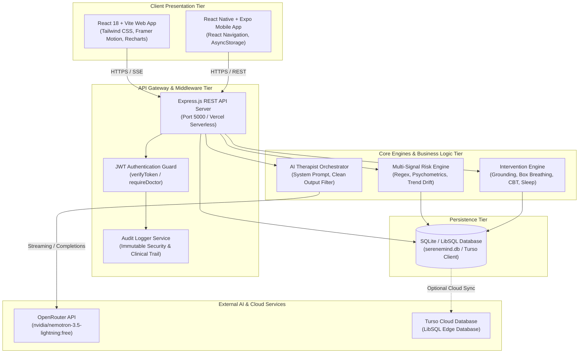
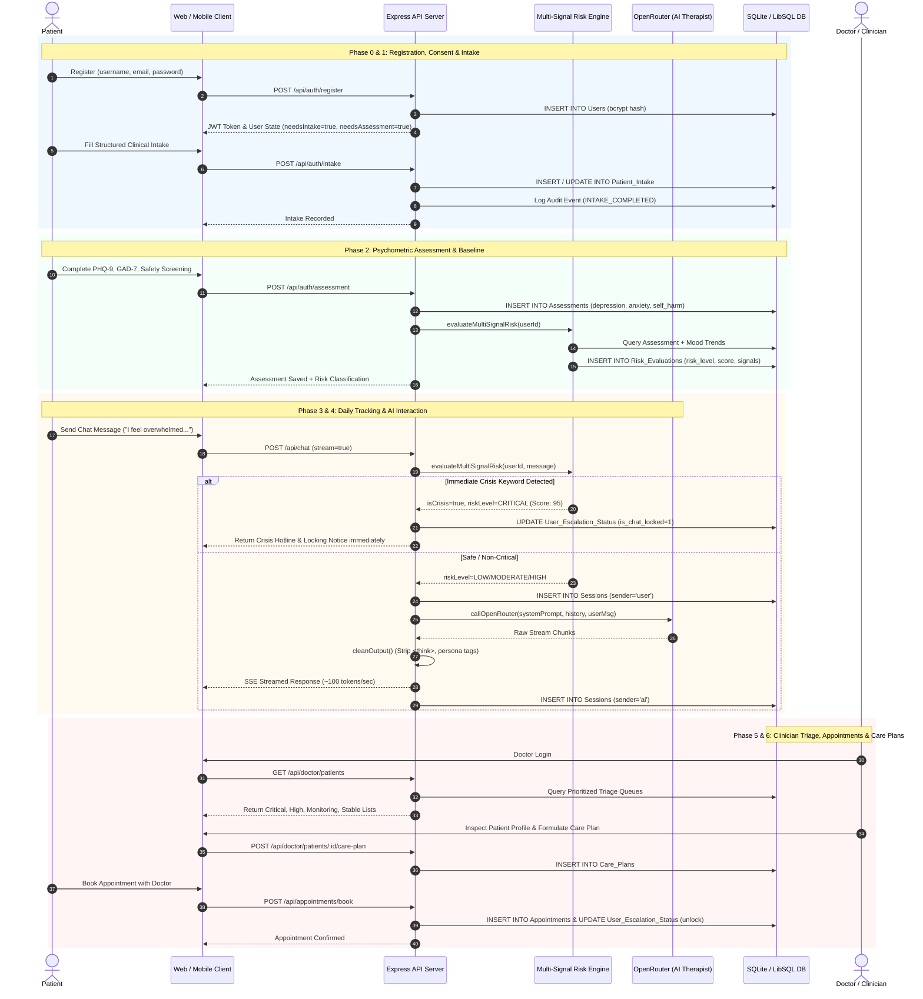
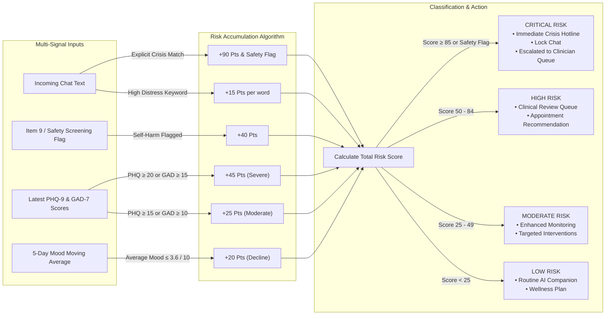
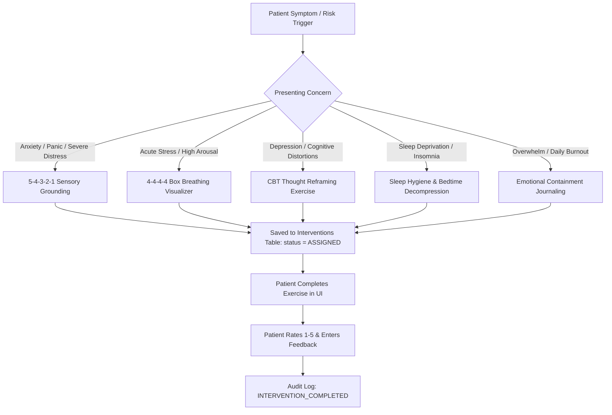
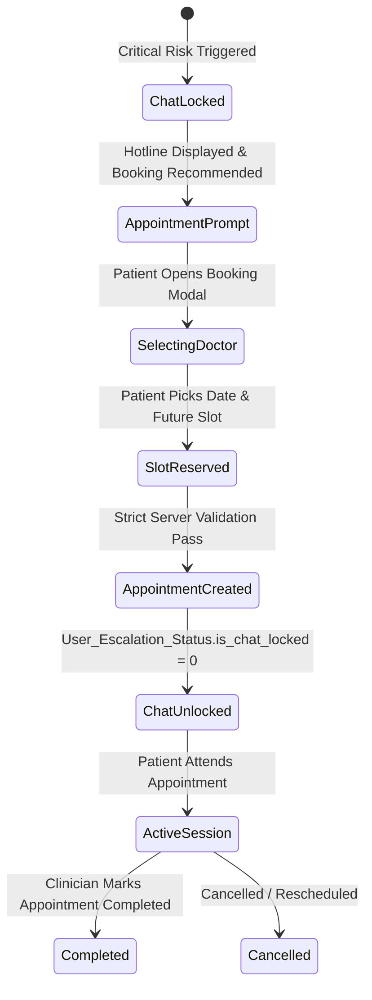

# SereneMind: Comprehensive System Workflows & Technical Architecture Specification

---

## 1. Executive Summary & System Philosophy

**SereneMind** is an enterprise-grade, privacy-conscious, risk-aware mental wellness companion and clinical triage platform. Unlike conventional mental health chatbots that rely purely on generative AI, SereneMind enforces a **closed-loop clinical care model**:

$$\text{Onboard} \longrightarrow \text{Establish Baseline} \longrightarrow \text{Detect Risk} \longrightarrow \text{Respond} \longrightarrow \text{Reassess} \longrightarrow \text{Escalate} \longrightarrow \text{Clinician Review} \longrightarrow \text{Continuous Care}$$

### Core Operating Tenets:
1. **Deterministic Safety Primacy**: High-stakes safety decisions, crisis protocols, and clinician escalations are governed strictly by deterministic, server-side business rules and validated scoring algorithms—never solely by generative LLM output.
2. **Multi-Signal Risk Synthesis**: Risk is continuously evaluated by fusing multiple data dimensions:
   - Validated psychometric instruments (**PHQ-9** for depression, **GAD-7** for anxiety, Stress index).
   - Dedicated Item-level crisis screening (**PHQ-9 Item 9** self-harm / suicidal ideation).
   - Real-time conversational regex & distress keyword pattern matchers.
   - Longitudinal affective drift (moving average of mood logs over time).
3. **Structured Clinical Interventions**: Beyond conversation, the system delivers structured somatic and cognitive tools (4-4-4-4 Box Breathing, 5-4-3-2-1 Sensory Grounding, CBT Thought Reframing, Sleep Hygiene, and Emotional Containment Journaling).
4. **Physician-in-the-Loop Triage**: A dedicated clinician portal organizes patients into prioritized triage queues (*Critical Attention*, *High Priority*, *Monitoring*, *Stable*), enabling psychiatrists and psychologists to inspect longitudinal timelines, formulate care plans, and conduct appointments.
5. **Cross-Platform Uniformity**: A unified backend REST API powers both a responsive **React (Vite) Web Application** and a native **React Native (Expo) Mobile Application** with identical data contracts and business logic.

---

## 2. High-Level System Architecture



---

## 3. End-to-End Core System Workflows



---

## 4. Phased Patient Journey (Detailed Lifecycle)

### Phase 0: Entry, Consent & Safety Notice
- **Registration & Authentication**:
  - The client provides username, email, and password.
  - The backend verifies username regex (`^[A-Za-z0-9._-]+$`, length 3-24), email format, and password length (minimum 8 characters, maximum 64).
  - Bcrypt generates a salted hash (cost factor 10).
  - A short-lived JSON Web Token (JWT) signed with `JWT_SECRET` is issued (7-day duration), carrying `{ id, username, role: 'patient' }`.
- **Safety Disclaimers & Emergency Banners**:
  - A persistent top banner displays 24/7 crisis numbers: **Umang Pakistan Mental Health Helpline (`0311-7786264`)** and **Emergency Rescue (`1122`)**.
  - Non-diagnostic disclosure: The user is notified that SereneMind is an assistive supportive platform and not a replacement for medical emergency intervention.

### Phase 1: Structured Clinical Intake
Before accessing chat or wellness features, new patients complete an extensive two-stage clinical intake form (`Patient_Intake` table):
1. **Personal & Emergency Demographics**:
   - Full legal name, date of birth (enforces age range 5–120), gender identity.
   - Primary phone number (`^\+?[0-9\s()-]{7,20}$`).
   - Primary emergency contact: Full name, phone number, relationship (e.g., Parent, Spouse/Partner, Sibling, Child, Guardian, Friend).
2. **Clinical & Psychosocial Context**:
   - Presenting problem (primary symptoms and chief complaints).
   - Duration of symptoms (`< 1 month`, `1 to 6 months`, `6 to 12 months`, `Over 1 year`).
   - Treatment goals and personal expectations.
   - Medical history: Current medications, physical ailments, previous therapy or psychiatric hospitalizations, and family mental health conditions.
   - Saves via `POST /api/auth/intake` with an `ON CONFLICT(user_id) DO UPDATE` pattern.

### Phase 2: Standardized Psychometric Assessment & Baseline State
Patients complete an evidence-based clinical screening (`Assessments` table):
- **Depression Scale (PHQ-9 derivative, Questions D1–D7)**:
  - Assesses anhedonia, depressed mood, sleep disturbances, fatigue, appetite changes, feelings of worthlessness/guilt.
  - **Item D7**: Explicit self-harm / suicidal ideation screening ("Thoughts that you would be better off dead or of hurting yourself"). A score $>0$ immediately flags `self_harm_risk = true`.
- **Anxiety Scale (GAD-7 derivative, Questions A1–A7)**:
  - Assesses nervousness, inability to control worrying, excessive worry, difficulty relaxing, restlessness, irritability, and impending dread.
- **Stress Scale (Questions S1–S7)**:
  - Evaluates perceived strain, concentration difficulties, coping ability, loss of confidence, anhedonia, and life overwhelm.
- **Scoring & Severity Cutoffs**:
  - `0–4`: Minimal
  - `5–9`: Mild
  - `10–14`: Moderate
  - `15+`: Severe
- Once submitted via `POST /api/auth/assessment`, the backend triggers `evaluateMultiSignalRisk(userId)`. If `self_harm_risk` is positive, an entry is written into `Safety_Screenings` with `escalation_status = 'ESCALATED'`, and an audit log event is recorded.

### Phase 3: Daily Care, Companion Chat & Structured Interventions
- **Daily Affective Check-In (`Mood_Logs`)**:
  - 1–10 validated mood slider plus contextual notes (sanitized up to 500 characters).
  - Calculates daily mood averages and renders 14-day longitudinal trend curves on the dashboard.
- **Interactive Grounding & Breathing Modals**:
  - **4-4-4-4 Box Breathing Visualizer**: Guided animated canvas/box (Inhale 4s ➔ Hold 4s ➔ Exhale 4s ➔ Hold 4s) to reset autonomic tone.
  - **5-4-3-2-1 Sensory Grounding**: Step-by-step cognitive diversion engaging visual, tactile, auditory, olfactory, and gustatory senses for acute panic/dissociation.
- **CBT Thought Reframing & Journaling**:
  - Helps identify cognitive distortions (catastrophizing, all-or-nothing thinking) and reframe thoughts into balanced reflections.

---

## 5. Multi-Signal Risk Engine & Decision Architecture

The Multi-Signal Risk Engine (`server/services/riskEngine.js`) prevents single-threshold blind spots by combining conversational, psychometric, and longitudinal indicators.



### Mathematical Scoring Weights

$$\text{Risk Score} = S_{\text{crisis}} + \sum S_{\text{distress}} + S_{\text{safety\_screen}} + S_{\text{assessment}} + S_{\text{mood\_drift}}$$

Where:
- $S_{\text{crisis}} = 90$ (if text matches regex: `suicide`, `kill myself`, `end my life`, `hurt myself`, `want to die`, `no reason to live`, `hang myself`, `overdose`, etc.)
- $S_{\text{distress}} = 15 \times N_{\text{keywords}}$ (`panic attack`, `terrified`, `paralyzed`, `unbearable`, `severe depression`, `hopeless`, `worthless`)
- $S_{\text{safety\_screen}} = 40$ (if `Assessments.self_harm_risk == true`)
- $S_{\text{assessment}} = 45$ (if $\text{PHQ} \ge 20$ or $\text{GAD} \ge 15$) or $25$ (if $\text{PHQ} \ge 15$ or $\text{GAD} \ge 10$)
- $S_{\text{mood\_drift}} = 20$ (if recent 3–5 mood logs average $\le 3.6 / 10$)

### Risk Engine Tiers & Automated Action Mapping:

| Risk Tier | Score Range / Triggers | System Action | Patient Experience |
| :--- | :--- | :--- | :--- |
| **CRITICAL** | Score $\ge 85$, Safety Flag, or Crisis Keyword | `IMMEDIATE_SAFETY_PROTOCOL_AND_CLINICAL_ESCALATION` | Chat is locked; emergency Pakistan crisis contacts (Umang `0311-7786264`, Rescue `1122`) are displayed; immediate dispatch to Doctor's Critical Attention queue. |
| **HIGH** | Score $50 - 84$ | `CLINICAL_REVIEW_QUEUE_AND_APPOINTMENT_RECOMMENDATION` | App highlights doctor booking; patient profile placed into Doctor's High Priority queue for review. |
| **MODERATE** | Score $25 - 49$ | `ENHANCED_MONITORING_AND_TARGETED_INTERVENTIONS` | System recommends targeted interventions (Grounding, Breathing); schedules follow-up checks. |
| **LOW** | Score $0 - 24$ | `WELLNESS_PLAN_AND_ROUTINE_AI_COMPANION` | Standard empathetic conversational companion, habit tracking, daily mood tracking. |

---

## 6. AI Conversation Pipeline & Safety Preprocessor

Every user message sent to `/api/chat` flows through a multi-stage validation and sanitation pipeline:

```
[User Message Inbound]
          │
          ▼
1. Preprocessor & Multi-Signal Risk Engine
   ├── Check regex crisis & high-distress keywords
   └── Check existing DB psychometrics & mood trajectory
          │
          ├── [CRITICAL / CRISIS DETECTED]
          │        │
          │        ▼
          │   - Return Deterministic Crisis Response (NO LLM invocation)
          │   - Update User_Escalation_Status (is_chat_locked = 1, tier = 'CRITICAL')
          │   - Recommend Emergency Hotlines (Umang, 1122)
          │   - Disallow freeform generation
          │
          └── [NON-CRITICAL / PASS]
                   │
                   ▼
2. Context Builder & Dynamic Prompt Injection
   ├── Base Persona: Licensed Psychotherapist & Wellness Companion
   ├── Modalities: Carl Rogers Person-Centered Therapy + CBT Framing
   ├── Instructions: 2-4 conversational sentences, direct empathy, 1 open question
   └── Injected Clinical State: PHQ-9 score, GAD-7 score, presenting problem
                   │
                   ▼
3. LLM Orchestration Layer
   ├── OpenRouter API: model `nvidia/nemotron-3.5-lightning:free`
   ├── Exponential Backoff Retry Handler (up to 2 retries on 429/5xx)
   └── Streaming SSE connection
                   │
                   ▼
4. Output Sanitizer & Post-Processor (`cleanOutput()`)
   ├── Strip XML tags: <think>...</think>
   ├── Strip therapist quotation prefixes: "I'll respond:", "Therapist:"
   ├── Strip internal reasoning lines: "The user is feeling...", "My goal is..."
   └── Strip numbered diagnostic bullet lists
                   │
                   ▼
5. Chunked SSE Delivery & Persistence
   ├── Tokens streamed to client at ~100 tokens/sec (~12ms pacing)
   ├── Message saved in `Sessions` table with risk tier & score
   └── Client renders real-time typewriter text with SereneBlob micro-animations
```

---

## 7. Structured Clinical Intervention Engine

The Intervention Engine (`server/services/interventionEngine.js`) maps diagnosed needs to specific, evidence-backed psychological exercises:



### Intervention Catalog:
1. **5-4-3-2-1 Sensory Grounding (`GROUNDING`)**:
   - Focuses patient awareness on 5 things they see, 4 they can touch, 3 they hear, 2 they smell, and 1 they taste.
2. **4-4-4-4 Box Breathing (`BOX_BREATHING`)**:
   - Autonomic nervous system regulation with timed 4-second breath intervals.
3. **CBT Thought Reframing (`COGNITIVE_REFRAMING`)**:
   - Deconstructs automatic thoughts, identifies distortions (magnification, emotional reasoning), and writes rational alternatives.
4. **Sleep Hygiene & Bedtime Decompression (`SLEEP_HYGIENE`)**:
   - Digital device curfew, stimulus control protocols, and progressive muscle relaxation before sleep.
5. **Emotional Containment Journaling (`EXPRESSIVE_JOURNALING`)**:
   - Controlled 5-minute writing exercise to externalize chaotic emotions into structured written thoughts.

---

## 8. Clinician Portal & Triage Workflows

Physicians and clinical psychologists log in via `/doctor-login` to access the clinical suite (`server/routes/doctor.js` and `src/components/DoctorDashboard.jsx`).

### 1. Prioritized Triage Queues
The doctor dashboard automatically sorts patients into 4 priority queues:
- **Critical Attention Queue**: Patients with active crisis keyword triggers, positive Item 9 self-harm scores, or risk score $\ge 85$.
- **High Priority Queue**: Patients with severe clinical depression ($\text{PHQ-9} \ge 15$), severe anxiety ($\text{GAD-7} \ge 15$), or downward risk trajectory.
- **Monitoring Queue**: Patients with moderate symptoms ($\text{PHQ-9}$ or $\text{GAD-7} \in [10, 14]$) or unstable mood trends.
- **Stable Queue**: Routine patients showing minimal/mild symptoms and positive trajectories.

### 2. Deep Patient Clinical Inspection
Selecting any patient provides full clinical access:
- **Intake Summary**: Full demographic profile, emergency contact, presenting concerns, medical history.
- **Psychometrics Breakdown**: Exact scores for depression, anxiety, stress, and Item 9 self-harm status.
- **Longitudinal Mood Graph**: Visual chart showing daily mood logs over the past 30 days.
- **Chat Session Transcripts**: Review AI-patient chat sessions with logged risk markers for each turn.
- **Audit Logging**: Accessing a patient record automatically writes a `CLINICIAN_VIEWED_PATIENT` entry into `Audit_Logs`.

### 3. Care Plan Formulation (`Care_Plans` table)
Clinicians create and assign formalized care plans via `POST /api/doctor/patients/:id/care-plan`:
- `primary_diagnosis_notes`: Clinician's diagnostic observations.
- `goals`: Clear milestones for therapy.
- `recommended_interventions`: Prescribed somatic or CBT modules.
- `follow_up_date`: Date for next clinical check-in.
- `status`: `ACTIVE`, `COMPLETED`, or `REVISED`.

### 4. Patient Progress Reports (`Patient_Reports` table)
- Clinicians author, review, and finalize structured clinical progress reports (`/api/reports`).
- Reports track patient status (`draft`, `pending`, `reviewed`) with doctor comments and markdown clinical notes.

---

## 9. Appointment Booking & Escalation Lifecycle



- **Validation Rules**:
  - Doctor ID must exist in `Doctors` table.
  - Appointment datetime must be valid ISO format and strictly in the future (`timestamp > now`).
  - Booking an appointment automatically resets `is_chat_locked = 0` in `User_Escalation_Status`, allowing the patient to resume AI companion support while awaiting their consultation.

---

## 10. Database Entity Model (Schema & Tables)

The system uses SQLite via `@libsql/client`, allowing local file operations (`serenemind.db`) or edge-replicated cloud execution via Turso DB.

```mermaid
erDiagram
    Users ||--o| Patient_Intake : "completes (1:1)"
    Users ||--o| Assessments : "submits (1:1)"
    Users ||--o| User_Escalation_Status : "tracks (1:1)"
    Users ||--o{ Chat_Sessions : "owns"
    Chat_Sessions ||--o{ Sessions : "groups"
    Users ||--o{ Sessions : "participates"
    Users ||--o{ Mood_Logs : "records"
    Users ||--o{ Risk_Evaluations : "evaluated_for"
    Users ||--o{ Interventions : "assigned"
    Users ||--o{ Safety_Screenings : "screened"
    Users ||--o{ Appointments : "books_as_patient"
    Doctors ||--o{ Appointments : "hosts_as_doctor"
    Doctors ||--o{ Doctor_Availability : "defines"
    Users ||--o{ Care_Plans : "assigned_to_patient"
    Doctors ||--o{ Care_Plans : "authored_by_clinician"
    Users ||--o{ Patient_Reports : "subject_of_report"
    Doctors ||--o{ Patient_Reports : "authored_by_doctor"
    Users ||--o{ Audit_Logs : "associated_with"

    Users {
        INTEGER id PK
        TEXT username UK
        TEXT email UK
        TEXT password_hash
        DATETIME created_at
    }

    Doctors {
        INTEGER id PK
        TEXT username UK
        TEXT full_name
        TEXT email UK
        TEXT password_hash
        TEXT specialization
        TEXT license_number
        DATETIME created_at
    }

    Patient_Intake {
        INTEGER id PK
        INTEGER user_id FK_UK
        TEXT full_legal_name
        TEXT date_of_birth
        TEXT gender_sex
        TEXT phone_number
        TEXT emergency_contact_name
        TEXT emergency_contact_relationship
        TEXT emergency_contact_phone
        TEXT presenting_problem
        TEXT symptom_duration
        TEXT treatment_goals
        TEXT current_medical_conditions
        DATETIME created_at
        DATETIME updated_at
    }

    Assessments {
        INTEGER id PK
        INTEGER user_id FK_UK
        TEXT answers
        INTEGER depression_score
        INTEGER anxiety_score
        INTEGER stress_score
        INTEGER total_score
        TEXT main_concern
        BOOLEAN self_harm_risk
        DATETIME timestamp
    }

    User_Escalation_Status {
        INTEGER id PK
        INTEGER user_id FK_UK
        INTEGER current_risk_score
        TEXT current_risk_tier
        BOOLEAN is_chat_locked
        DATETIME last_escalation_timestamp
        DATETIME updated_at
    }

    Chat_Sessions {
        INTEGER id PK
        INTEGER user_id FK
        TEXT title
        DATETIME created_at
    }

    Sessions {
        INTEGER id PK
        INTEGER user_id FK
        INTEGER session_id FK
        TEXT sender
        TEXT content
        TEXT risk_level
        INTEGER risk_score
        DATETIME timestamp
    }

    Mood_Logs {
        INTEGER id PK
        INTEGER user_id FK
        INTEGER mood_score
        TEXT notes
        DATE date
    }

    Risk_Evaluations {
        INTEGER id PK
        INTEGER user_id FK
        TEXT risk_level
        INTEGER risk_score
        TEXT triggered_signals
        TEXT action_taken
        TEXT clinician_review_status
        DATETIME created_at
    }

    Interventions {
        INTEGER id PK
        INTEGER user_id FK
        TEXT type
        TEXT title
        TEXT description
        TEXT status
        INTEGER patient_rating
        TEXT patient_feedback
        DATETIME created_at
        DATETIME completed_at
    }

    Appointments {
        INTEGER id PK
        INTEGER patient_id FK
        INTEGER doctor_id FK
        DATETIME appointment_datetime
        TEXT status
        TEXT risk_tier
        TEXT notes
        DATETIME created_at
    }

    Care_Plans {
        INTEGER id PK
        INTEGER patient_id FK
        INTEGER clinician_id FK
        TEXT primary_diagnosis_notes
        TEXT goals
        TEXT recommended_interventions
        DATE follow_up_date
        TEXT status
        DATETIME created_at
    }

    Audit_Logs {
        INTEGER id PK
        TEXT event_type
        INTEGER user_id FK
        INTEGER actor_id
        TEXT actor_role
        TEXT details
        TEXT ip_address
        DATETIME created_at
    }
```

---

## 11. REST API Specification

### Authentication & Intake Routes (`/api/auth`)
| Method | Endpoint | Auth | Purpose & Payload Details |
| :--- | :--- | :--- | :--- |
| `POST` | `/api/auth/register` | Public | Registers a new patient. `{ username, email, password, confirmPassword }`. Enforces password matching, format regex, and bcrypt hashing. |
| `POST` | `/api/auth/login` | Public | Patient login. `{ identifier, password }`. Identifier can be email or username. Returns JWT and flags `needsIntake`, `needsAssessment`. |
| `POST` | `/api/auth/doctor/register` | Public | Clinician registration. `{ username, email, fullName, password, licenseNumber, specialization }`. |
| `POST` | `/api/auth/doctor/login` | Public | Clinician login. Issues JWT carrying `role: 'doctor'`. |
| `GET` | `/api/auth/intake` | JWT (Patient) | Fetches user's completed clinical intake form if present. |
| `POST` | `/api/auth/intake` | JWT (Patient) | Submits full clinical intake form. Upserts `Patient_Intake` table and logs `INTAKE_COMPLETED`. |
| `POST` | `/api/auth/assessment` | JWT (Patient) | Submits PHQ-9, GAD-7, and stress assessment. Triggers `evaluateMultiSignalRisk()`, writes `Safety_Screenings` if self-harm detected, and logs audit events. |
| `DELETE`| `/api/auth/account` | JWT (Patient) | Right-to-be-forgotten endpoint. Permanently cascades delete for user, chats, intake, mood, and assessments. Logs `ACCOUNT_DELETED`. |

### Conversational AI & Sessions (`/api/chat`)
| Method | Endpoint | Auth | Purpose & Payload Details |
| :--- | :--- | :--- | :--- |
| `POST` | `/api/chat` | JWT (Patient) | Primary chat endpoint. Supports Server-Sent Events (`stream=true`). Evaluates multi-signal risk on message. If crisis, returns emergency fallback; otherwise streams sanitized therapist completion. |
| `GET` | `/api/chat/history` | JWT (Patient) | Fetches messages for user's latest session, hydrating the active view. |
| `GET` | `/api/chat/sessions` | JWT (Patient) | Lists all past chat sessions for user. |
| `POST` | `/api/chat/sessions` | JWT (Patient) | Creates a new named session (e.g. "Session 3"). |
| `GET` | `/api/chat/sessions/:id/history` | JWT (Patient) | Fetches message history for a specific past session. |
| `DELETE`| `/api/chat/sessions/:id` | JWT (Patient) | Deletes a specific session and all its messages. |
| `DELETE`| `/api/chat/history` | JWT (Patient) | Wipes all chat sessions and messages for data sovereignty. |
| `GET` | `/api/chat/escalation-status` | JWT (Patient) | Checks if user's chat is currently locked due to crisis. |
| `POST` | `/api/chat/unlock` | JWT (Patient) | Unlocks chat and clears crisis state. |

### Clinician Triage Portal (`/api/doctor`)
| Method | Endpoint | Auth | Purpose & Payload Details |
| :--- | :--- | :--- | :--- |
| `GET` | `/api/doctor/patients` | JWT (`doctor`) | Returns all registered patients categorized by triage queues: `criticalAttention`, `highPriority`, `monitoring`, `stable`. |
| `GET` | `/api/doctor/patients/:id` | JWT (`doctor`) | Returns 360-degree patient timeline: demographics, intake, assessment sub-scores, 30-day mood logs, risk evaluations, care plans, and sessions. Logs `CLINICIAN_VIEWED_PATIENT`. |
| `POST` | `/api/doctor/patients/:id/care-plan` | JWT (`doctor`) | Authors or updates clinical care plan. `{ primary_diagnosis_notes, goals, recommended_interventions, follow_up_date }`. |

### Appointments & Availability (`/api/appointments`)
| Method | Endpoint | Auth | Purpose & Payload Details |
| :--- | :--- | :--- | :--- |
| `GET` | `/api/appointments/doctors` | JWT | Lists available clinicians with specializations. |
| `GET` | `/api/appointments/doctors/:id/availability`| JWT | Generates or fetches time slots for a given clinician. |
| `POST` | `/api/appointments/book` | JWT (Patient) | Books a consultation slot. Validates future date, persists appointment, and unlocks chat if locked. |
| `GET` | `/api/appointments/my-appointments` | JWT (Patient) | Lists upcoming and past appointments for logged-in patient. |
| `GET` | `/api/appointments/doctor-appointments` | JWT (`doctor`) | Lists all booked appointments for the authenticated doctor. |
| `PUT` | `/api/appointments/:id/status` | JWT (`doctor`) | Updates appointment status: `SCHEDULED`, `COMPLETED`, `CANCELLED`, `NO_SHOW`. |

### Dashboard Analytics & Mood Tracking (`/api/dashboard`)
| Method | Endpoint | Auth | Purpose & Payload Details |
| :--- | :--- | :--- | :--- |
| `POST` | `/api/dashboard/mood` | JWT (Patient) | Logs 1-10 mood score and notes into `Mood_Logs`. |
| `GET` | `/api/dashboard/stats` | JWT (Patient) | Computes total messages, crisis alerts, mood streak days, average mood score, and 14-day Recharts trend data. |
| `GET` | `/api/dashboard/reports` | JWT (Patient) | Generates milestone notifications and automated wellness insights. |

---

## 12. Security, Compliance & Audit Trail Architecture

### 1. Immutable Audit Logging
The `Audit_Logs` table maintains an append-only ledger of all clinical, authentication, and safety occurrences via `server/services/auditLogger.js`:
- `LOGIN` • `DOCTOR_REGISTERED` • `ACCOUNT_DELETED`
- `INTAKE_COMPLETED`
- `PHQ9_COMPLETED` • `GAD7_COMPLETED` • `SAFETY_SCREEN_COMPLETED`
- `RISK_EVALUATED` • `RISK_CHANGED` • `ESCALATION_CREATED`
- `INTERVENTION_COMPLETED`
- `CLINICIAN_VIEWED_PATIENT` • `CARE_PLAN_CREATED`
- `APPOINTMENT_CREATED` • `APPOINTMENT_UPDATED`

### 2. Guarding Sensitive Data & Cascading Deletion
- Foreign key constraints enforce `ON DELETE CASCADE`. If a patient requests account removal (`DELETE /api/auth/account`), all associated records in `Patient_Intake`, `Assessments`, `Sessions`, `Chat_Sessions`, `Mood_Logs`, `Risk_Evaluations`, `Interventions`, `Safety_Screenings`, and `Appointments` are removed immediately.
- Password hashes use bcrypt with 10 salt rounds; plaintext passwords are never logged or stored.

---

## 13. Cross-Platform Parity (Web & Mobile)

SereneMind guarantees that clinical safety is never client-dependent:
1. **Identical REST Contracts**: The React Web SPA (`src/`) and the React Native Mobile app (`mobile/`) call the exact same API endpoints (`/api/auth`, `/api/chat`, `/api/doctor`, `/api/appointments`, `/api/dashboard`).
2. **Deterministic Processing**: Risk scoring, crisis regex parsing, safety screening evaluation, and chat locking execute strictly on the Node.js server.
3. **Feature Parity Table**:

| Feature | React Web App (`src/`) | React Native Mobile App (`mobile/`) |
| :--- | :--- | :--- |
| **Authentication & Intake** | Full 2-step clinical intake & login | Full 2-step clinical intake & login |
| **Psychometric Testing** | 21-item interactive assessment | Step-by-step mobile assessment |
| **AI Therapist Chat** | Real-time SSE streaming & SereneBlob | Real-time chat with crisis banner & lock |
| **Grounding & Breathing** | 4-4-4-4 Box Breathing & 5-4-3-2-1 Modal | Native Animated Box Breathing Modal |
| **Mood Tracking** | Slider + 14-day Recharts line graph | Slider + native trend visualization |
| **Doctor Triage Portal** | 4-queue triage dashboard & care plan editor | Doctor triage screens with queue filtering |
| **Appointment Booking** | Modal calendar with slot selector | Mobile doctor slot booking list |
| **Crisis Hotlines** | 24/7 top bar + inline crisis links | Click-to-call direct phone dialers |

---

## 14. Summary of System Operation

When SereneMind runs in production:
1. A patient enters the platform, registers, and acknowledges the emergency crisis boundaries.
2. The patient provides background medical and psychosocial history via **Structured Intake**.
3. The patient takes the baseline **PHQ-9 / GAD-7 Assessment**, capturing baseline severity and screening for self-harm.
4. The **Multi-Signal Risk Engine** calculates a real-time risk score and establishes the patient's baseline state.
5. In daily companion chat, every turn is preprocessed by deterministic safety rules:
   - If crisis keywords are present, immediate safety hotlines are presented, chat locks, and clinicians are notified.
   - If non-critical, the AI therapist generates Carl Rogers & CBT-aligned empathetic responses, filtered to remove internal chain-of-thought and diagnostic assumptions.
6. The patient utilizes interactive **Box Breathing** or **Sensory Grounding** tools to regulate distress.
7. Clinicians log into the **Doctor Portal**, inspect prioritized triage queues, review longitudinal charts, author care plans, and conduct appointments.
8. Every critical action is recorded immutably in `Audit_Logs`, ensuring a secure, clinically accountable, and ethical mental health platform.
