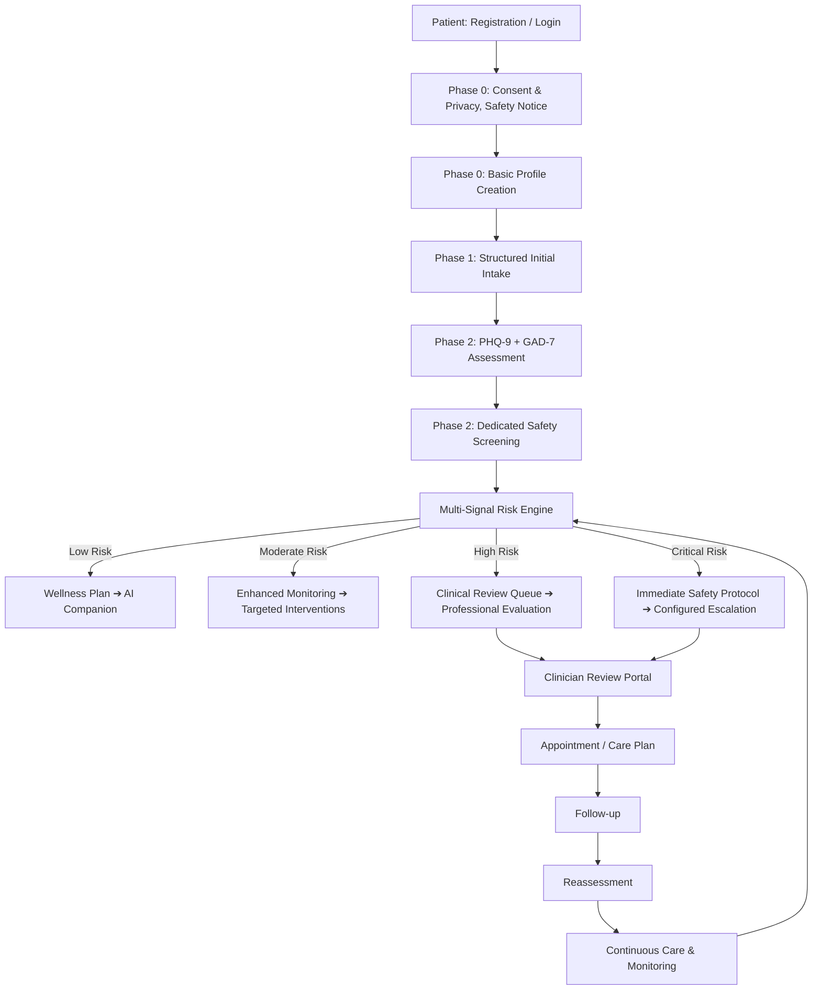

# SereneMind: Improved End-to-End System Workflow & Logical Architecture

**Objective**: Transform SereneMind from a conventional AI wellness chatbot into a risk-aware, privacy-conscious, AI-assisted mental-health support and clinical triage platform.

---

## 1. Core System Philosophy

```
Lifecycle: Onboard ➔ Establish Baseline ➔ Detect Risk ➔ Respond ➔ Reassess ➔ Escalate ➔ Clinician Review ➔ Follow-up ➔ Continuous Care
```

The system does not depend on a single PHQ-9/GAD-7 threshold or on generative AI alone. Validated questionnaires, explicit safety screening, conversational signals, longitudinal trends, deterministic safety rules, and clinician review work in unison.

---

## 2. High-Level Workflow



---

## 3. Patient Journey (Phased Lifecycle)

### Phase 0 — Entry, Consent & Safety Notice
- **Registration / Login**: Secure authentication with short-lived tokens and refresh mechanisms.
- **Privacy & Data Consent**: Explicit storage, processing, and clinical sharing disclosures.
- **AI Limitations & Non-Diagnostic Disclaimer**: Clear notice that AI is supportive and not a licensed diagnostic authority.
- **Emergency / Safety Notice**: Prominent display of emergency crisis hotlines (e.g. 988) accessible at all times.
- **Basic Profile Creation**: Demographic and preferred communication preferences.

### Phase 1 — Structured Intake
- Primary concerns and symptoms (presenting complaints).
- Duration and functional impact (work, school, relationships).
- Sleep, appetite, energy, and concentration levels.
- Previous therapy and psychiatric treatment experience.
- Current medications and relevant medical history.
- Family mental-health history.
- Personal wellness goals.

### Phase 2 — Baseline Assessment
- **PHQ-9**: Standardized 9-question depression inventory.
- **GAD-7**: Standardized 7-question anxiety inventory.
- **Dedicated Safety Screening**: Explicit self-harm / crisis detection item.
- **Initial Risk Evaluation**: Baseline state classification across Low, Moderate, High, and Critical.
- **Creation of Baseline Patient State**: Persisted longitudinal baseline record.

### Phase 3 — Daily Care
- **Daily Mood Check-in**: 5-point validated affective state logging with contextual notes.
- **Sleep / Energy / Anxiety Check**: Micro-indicators logged longitudinally.
- **AI Companion**: Empathetic, supportive conversational agent.
- **Grounding & Breathing Exercises**: Interactive Box Breathing (4-4-4-4) & 5-4-3-2-1 sensory technique.
- **Journaling & CBT-Style Supportive Interventions**: Cognitive reframing and structured thought records.
- **Progress Tracking**: Longitudinal visualization of mood and clinical indices.

### Phase 4 — Continuous Risk Monitoring
- Analyze significant conversational signals during companion chats.
- Track mood and symptom trend deviations from baseline.
- Detect changes in severity from baseline.
- Trigger automatic reassessment prompts when risk shifts.
- Escalate immediately when configured safety criteria are met.

---

## 4. Improved AI Chat Architecture

```
User Message
     │
     ▼
Input Preprocessor
     │
     ▼
Safety / Risk Analyzer (Deterministic Regex & Heuristic Safety Rules)
     │
     ▼
Context Builder (User History, Baseline State, Current Interventions)
     │
     ▼
AI Response Generator (Google Gemini Orchestration Layer)
     │
     ▼
Response Validator
     ├── PASS ➔ Send Empathetic Response
     └── FAIL ➔ Safe Crisis Fallback & Escalation Trigger
     │
     ▼
Session Logger & Longitudinal Monitoring
```

### AI Responsibilities:
- Understand conversational context and emotional signals.
- Provide empathetic, non-diagnostic supportive responses.
- Suggest appropriate wellness interventions.
- Summarize sessions for authorized clinical review.
- **Support—not replace—deterministic safety and clinical escalation logic.**

---

## 5. Multi-Signal Risk Engine

The system replaces simplistic single-score thresholds (`PHQ-9 ≥ 15 or GAD-7 ≥ 15 = High Risk`) with a multi-signal risk engine incorporating assessment scores, safety item responses, conversational sentiment flags, and trend trajectories.

| Level | Criteria / Triggers | System Response |
| :--- | :--- | :--- |
| **Low** | PHQ-9 < 10, GAD-7 < 10, no safety flags, stable trends | Normal AI companion, wellness exercises, mood tracking, and routine reassessment. |
| **Moderate** | PHQ-9 (10–14) or GAD-7 (10–14), declining mood trajectory | Enhanced monitoring, targeted interventions, and encouragement to schedule professional appointments. |
| **High** | PHQ-9 (15–19) or GAD-7 (15–19), significant symptom escalation | Routed to Clinician Review Queue, recommended clinical evaluation, and increased monitoring frequency. |
| **Critical** | PHQ-9 / GAD-7 (20–27), safety item positive, or explicit crisis speech | Immediate safety protocol activation, crisis hotline delivery, automatic clinical escalation, and clinical follow-up priority. |

---

## 6. Safety & Escalation Workflow

```
Risk Signal Detected
     │
     ▼
Risk Engine Severity Classification
     ├── Low ───────➔ Continue Routine Monitoring
     ├── Moderate ──➔ Enhanced Monitoring & Reassessment Prompt
     ├── High ──────➔ Create Clinical Review Ticket & Suggest Booking
     └── Critical ──➔ Immediate Safety Protocol
                            │
                            ▼
                    Safety Guidance & Hotlines Displayed
                            │
                            ▼
                    Configured Escalation Triggered
                            │
                            ▼
                    Clinician Review in Doctor Portal
                            │
                            ▼
                    Contact / Appointment / Care Plan
                            │
                            ▼
                    Follow-up & Continuous Care
```

> [!IMPORTANT]
> **Safety Principle**: A generative AI model must not be the sole authority for emergency or high-stakes safety decisions. Clearly defined deterministic rules and clinician workflows control escalation.

---

## 7. Structured Intervention Engine

SereneMind responds to detected needs with structured clinical interventions rather than only generic conversational text:

- **Anxiety** ➔ Grounding exercises, Box Breathing, progressive muscle relaxation, and cognitive reframing.
- **Stress** ➔ Guided relaxation, expressive journaling, and problem-solving coping strategies.
- **Negative Thinking** ➔ Automatic thought identification, cognitive distortion spotting, and reframing.
- **Sleep Difficulty** ➔ Sleep-hygiene psychoeducation, stimulus control, and bedtime wind-down routines.
- **Emotional Distress** ➔ Supportive conversational containment and appropriate escalation.
- **Persistent Symptoms** ➔ Professional healthcare evaluation recommendations.

$$\text{Intervention} \longrightarrow \text{Patient Response} \longrightarrow \text{Effectiveness Rating} \longrightarrow \text{Future Recommendation}$$

---

## 8. Clinician Workflow & Portal

```
Clinician Login
     │
     ▼
Clinician Dashboard
     ├── Critical Attention Queue (Immediate crisis flags)
     ├── High Priority Queue (Escalated PHQ/GAD or severe trends)
     ├── Monitoring Queue (Moderate risk / declining trajectories)
     ├── Stable Queue (Low risk routine patients)
     ├── Appointments Schedule (Booking requests & calendar)
     └── Follow-ups & Notes
     │
     ▼
Patient Clinical Profile
     ├── Current Risk & Trigger Reason
     ├── Risk History & Longitudinal Trends
     ├── PHQ-9 / GAD-7 Score Breakdown
     ├── Mood & Symptom Trajectory Graphs
     ├── Recent AI Session Clinical Summaries
     ├── Escalation Details & Audit Trail
     ├── Appointment History
     ├── Clinician Progress Notes
     └── Care Plan Formulation
```

---

## 9. Longitudinal Patient Timeline Example

```
Day 1  ➔ Structured Intake + Baseline Assessments completed ➔ Low Risk
Day 7  ➔ Daily mood logs show downward shift ➔ Flagged for Enhanced Monitoring
Day 14 ➔ Symptom increases detected ➔ Automated Reassessment triggered
Day 18 ➔ Concerning conversational signals detected ➔ Risk Escalation triggered
Day 19 ➔ Clinician reviews patient profile and escalation notes
Day 21 ➔ Patient attends Clinician Appointment; Care Plan formulated
Day 28 ➔ Structured Follow-up & Interventions tracking
Day 30 ➔ Reassessment administered
            │
            ├── Improved? (YES) ➔ Continue Maintenance Care Plan
            └── Improved? (NO)  ➔ Modify Care Plan / Escalate Support
```

---

## 10. Logical Backend Architecture & Modules

```
React Web App ────────┐
                      ├──➔ Express REST API Layer
React Native App ─────┘           │
                                  ▼
        ┌─────────────────────────┼─────────────────────────┐
        ▼                         ▼                         ▼
Authentication Module    Patient / Data Module      Clinical Module
- Roles (Patient/Doctor) - Structured Intake        - Appointments
- Sessions & JWT Tokens  - Mood & Symptoms Logs     - Escalations
                         - Assessments (PHQ/GAD)    - Care Plans
                         - Conversations & Messages - Audit Log
        │                         │                         │
        └─────────────────────────┼─────────────────────────┘
                                  ▼
                    ┌───────────────────────────┐
                    ▼                           ▼
               Risk Engine             Intervention Engine
                    └─────────────┬─────────────┘
                                  ▼
                       AI Orchestration Layer
                                  │
                                  ▼
                   Gemini Model Provider / Fallback
                                  │
                                  ▼
                            SQLite Database
```

### Core Backend Modules
- `auth`: Short-lived JWT authentication, role guards (Patient, Clinician, Admin).
- `users`: User profiles and settings.
- `intake`: Structured medical and lifestyle intake processing.
- `assessments/phq9` & `assessments/gad7`: Questionnaire scoring and sub-item analysis.
- `safety`: Deterministic regex/keyword and emergency escalation handler.
- `risk`: Multi-signal evaluation engine.
- `conversations` & `ai`: Chat orchestration, prompt context builders, and response validation.
- `interventions`: Structured exercise dispatchers (Breathing, Grounding, Thought Reframing).
- `mood`: Longitudinal affective state logging.
- `appointments`: Booking, slot scheduling, and status lifecycle management.
- `clinicians`: Clinical triage queues, note taking, and care plans.
- `escalations`: Clinical alert tracking and emergency protocol triggers.
- `reports`: Clinical progress report compilation and PDF export formatters.
- `audit`: Immutable security and clinical audit trails.

---

## 11. Database Entity Model

```
User (id, email, password_hash, role, created_at)
  │── PatientProfile (user_id, full_name, age, preferences, baseline_status)
  │── Intake (user_id, medical_history, family_history, lifestyle, therapy_history, goals)
  │── Assessments
  │     ├── PHQ9 (id, user_id, score, item_answers, completed_at)
  │     └── GAD7 (id, user_id, score, item_answers, completed_at)
  │── SafetyScreenings (id, user_id, trigger_source, item_score, flagged_at)
  │── MoodEntries (id, user_id, mood_score, notes, created_at)
  │── Conversations (id, user_id, title, created_at)
  │     └── Messages (id, conversation_id, sender, content, safety_flag, timestamp)
  │── RiskEvaluations (id, user_id, risk_level, triggered_signals, action_taken, clinician_status)
  │── Interventions (id, user_id, type, status, patient_rating, timestamp)
  │── Escalations (id, user_id, severity, reason, status, clinician_id, resolved_at)
  │── Appointments (id, patient_id, doctor_id, appointment_date, status, notes)
  │── CarePlans (id, patient_id, clinician_id, goals, recommendations, updated_at)
  └── Reports (id, patient_id, summary_content, phq_trend, gad_trend, generated_at)
```

---

## 12. Security, Audit & Cross-Platform Rules

### Comprehensive Audit Trail Events
All security and clinical actions are logged immutably:
`LOGIN` • `INTAKE_COMPLETED` • `PHQ9_COMPLETED` • `GAD7_COMPLETED` • `SAFETY_SCREEN_COMPLETED` • `RISK_EVALUATED` • `RISK_CHANGED` • `ESCALATION_CREATED` • `CLINICIAN_VIEWED_PATIENT` • `APPOINTMENT_CREATED` • `APPOINTMENT_UPDATED` • `REPORT_GENERATED` • `REPORT_EXPORTED`

### Cross-Platform Rule
Web and Mobile applications use identical backend API contracts. All clinical evaluation, risk determination, safety monitoring, and escalation triggers reside strictly server-side. Frontend clients consume and render the validated server state.
